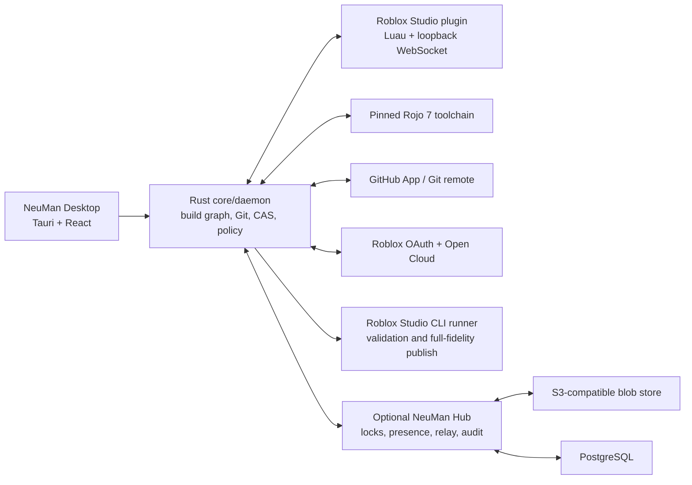

# Roblox Build Manager Architecture

Status: proposed architecture  
Date: 2026-07-09  
External sources last verified: 2026-07-09  
Working name: **NeuMan**

## Executive decision

Build the product, but build it as a hybrid of a native desktop application, a Roblox Studio plugin, a pinned Rojo toolchain, and an optional self-hosted team relay. A desktop application alone cannot observe or safely mutate a live Studio data model, and Roblox's documented web APIs do not provide complete OAuth-based place download and publication.

The central design rule is:

> Studio is the editing authority for art, Git is the editing authority for code, immutable build manifests are the authority for releases, and production is an output—not a source of truth.

That rule creates four distinct states:

| State | Authority | Mutable? | Purpose |
|---|---|---:|---|
| Code workspace | A Git branch/worktree | Yes | Developer edits and code review |
| Art authoring channel | A designated Team Create place plus NeuMan Studio plugin | Yes | Artist edits |
| Accepted art revision | Content-addressed `.rbxm` cells, terrain tiles, and sidecar metadata | No | Reviewable, reproducible build input |
| Deployment | A recorded Roblox place version produced from a build manifest | No | Staging or production runtime |

The manager must never silently merge production back into Git or silently overwrite local Studio edits. Unexpected production changes are **drift**. NeuMan can capture them into an adoption branch for review, but it must not declare them canonical automatically.

## What is feasible today

### First-party Roblox OAuth: yes

Roblox supports OAuth 2.0 authorization code flow with PKCE for public clients. A desktop executable should use the system browser, a random PKCE verifier, `S256`, `state`, `nonce`, and either a registered custom URI or loopback redirect. A public client passes its client ID and code challenge instead of embedding a client secret. Tokens belong in the operating system credential vault, not a config file. Roblox access tokens last 15 minutes and rotating refresh tokens last 90 days according to the current reference.

Use the minimum scopes needed for the current screen. Account connection starts with `openid` and `profile`. Request `universe:read` through a new consent transaction only when the user activates resource selection, and request write scopes only when a feature needs them. Use the token-resources endpoint to prove access to the selected universe rather than trusting a user-entered ID.

Sources: [Roblox OAuth overview](https://create.roblox.com/docs/cloud/auth/oauth2-overview), [OAuth endpoint reference](https://create.roblox.com/docs/cloud/auth/oauth2-reference), [OAuth app registration](https://create.roblox.com/docs/cloud/auth/oauth2-registration).

### Universe and place management: mostly yes through OAuth

The stable Open Cloud `Get Universe`, `Update Universe`, `Get Place`, and `Update Place` endpoints accept OAuth. Server restart and some server-management endpoints also accept OAuth. This is enough for account identity, resource selection, place metadata, environment dashboards, and controlled post-release restarts.

Source: [Roblox Open Cloud API index](https://create.roblox.com/docs/cloud/reference/domains/apis).

### Code synchronization: yes, and Rojo should remain the compatibility layer

Rojo 7.7 is the de-facto Roblox filesystem-to-Studio toolchain. It builds places, live-syncs code and models, generates source maps, supports syncback, and now exposes optional two-way sync for supported changes. NeuMan should orchestrate a project-pinned Rojo binary rather than invent another code mapping format.

Code flow should always be:

1. Fetch or update the developer's Git branch/worktree.
2. Let Git perform text merge/rebase and surface conflicts on disk.
3. Let Rojo synchronize the resulting filesystem state into Studio.
4. Keep Studio-side scripts under Git ownership; artist-authored cells must not contain executable scripts.

Do not apply remote Git code directly to `Script.Source` behind the filesystem's back. That creates a Studio state that cannot be explained by Git.

Sources: [Rojo repository and current feature set](https://github.com/rojo-rbx/rojo), [Rojo sync details](https://rojo.space/docs/v7/sync-details/), [Rojo 7.7 syncback changes](https://github.com/rojo-rbx/rojo/blob/master/CHANGELOG.md).

### Full-fidelity art transfer without reopening Studio: yes, with a plugin

The current Roblox engine provides the two pieces this needs:

- `SerializationService:SerializeInstancesAsync()` and `DeserializeInstancesAsync()` allow a Studio plugin to round-trip native `.rbxm` content.
- `HttpService:CreateWebStreamClient()` provides Studio-only WebSocket or streaming connections.

The plugin can serialize a registered art cell, send the bytes to the local desktop daemon, receive a newer cell, deserialize it, and replace the old cell inside a `ChangeHistoryService` recording. The place does not need to be reopened.

Roblox offers no stability contract for the `.rbxm` format, so NeuMan must store the raw native bytes, record the Studio/API schema version that produced them, test migrations on Studio updates, and retain full-place recovery snapshots. It should not claim that arbitrary old model bytes will remain portable forever.

Sources: [Roblox SerializationService](https://create.roblox.com/docs/reference/engine/classes/SerializationService), [HttpService streaming](https://create.roblox.com/docs/reference/engine/classes/HttpService), [Studio plugin undo/redo](https://create.roblox.com/docs/studio/plugins).

### Automated publication: two paths, neither universally perfect

#### Path A — Studio-assisted publication, the safe public default

Roblox Studio has a documented command-line `RunScript` task. It can load a local or published place, execute a fixed Luau runner with command-bar permissions, write output, and quit. However, `SerializationService` is explicitly limited to Studio plugins and Open Cloud Luau Execution sessions, so NeuMan must not assume a `RunScript` thread can deserialize RBXM. The signed NeuMan Studio plugin is the public desktop's native assembly authority. `AssetService:SavePlaceAsync()` can save or publish the current data model when the target has enabled that API.

This permits a high-fidelity publisher design:

1. Rojo builds code and placeholder art slots into a local candidate place.
2. Studio opens that local place with the signed NeuMan plugin active; CLI launch/validation remains optional.
3. The plugin retrieves exact native art cells from the loopback daemon and deserializes them through plugin-authorized `SerializationService`.
4. The plugin validates the signed declarative runner manifest, ownership, and dependencies and returns a signed receipt.
5. After explicit user approval, `SavePlaceAsync({ PlaceId = target, SaveWithoutPublish = false })` publishes through the signed-in Studio account.

Important restriction: an active Team Create session blocks `SavePlaceAsync`, so publication should occur from a local candidate file, not from the live authoring place.

This exact plugin plus `SavePlaceAsync` path must be a Phase 0 spike before it is promised as unattended production behavior. `RunScript` remains separately qualified for its documented command-bar capabilities, output, and exit behavior; it is not the RBXM deserialization authority.

Sources: [Roblox Studio command-line interface](https://create.roblox.com/docs/studio/command-line-interface), [AssetService SavePlaceAsync](https://create.roblox.com/docs/reference/engine/classes/AssetService).

#### Path B — Open Cloud publication, useful for trusted CI

The Place Publishing API accepts `.rbxl` or `.rbxlx` and returns a place version number. Roblox also provides stable Luau Execution APIs that can run a fixed script headlessly against an exact place/version, accept binary inputs, use `SerializationService`, and save through `SavePlaceAsync`. These surfaces are suitable for operator-owned CI but are currently API-key-only. Direct place-file publication also does not update certain modified native instance types, so the Luau Execution profile is the higher-fidelity CI option when its exact class/capability corpus passes.

For a public third-party application, do **not** ask users to paste Roblox API keys into NeuMan. Roblox's Creator Third Party App Policy explicitly says third-party apps must not request API keys from other users. A self-hosting operator can configure credentials in their own CI infrastructure, but the public desktop product should not collect, proxy, or upload those keys. The clean long-term solution is for Roblox to add OAuth support to place publication or approve a specific integration.

Sources: [Place Publishing guide and limitations](https://create.roblox.com/docs/cloud/guides/usage-place-publishing), [Luau Execution](https://create.roblox.com/docs/cloud/reference/features/luau-execution), [SerializationService](https://create.roblox.com/docs/reference/engine/classes/SerializationService), [Creator Third Party App Policy](https://en.help.roblox.com/hc/en-us/articles/37924211313044-Creator-Third-Party-App-Policy).

## What cannot be honestly promised

1. **Arbitrary automatic `.rbxm` merge.** A model can contain CSG, editable meshes, terrain-adjacent data, object references, packages, and engine-private serialized state. No general algorithm can safely merge two conflicting binary versions.
2. **Pure OAuth whole-place publishing.** The documented publishing endpoint is API-key-only today.
3. **Pure web-API whole-place pull.** Open Cloud can read/update collaborative scripts in beta, but not download and semantically enumerate the entire art data model through OAuth. Studio/plugin capture is the supported bridge.
4. **Atomic release of multiple places.** Roblox publishes one place version at a time. NeuMan can orchestrate, verify, and compensate with rollback, but it cannot create a cross-place transaction.
5. **Instant sync while Studio or the plugin is offline.** The desktop can queue revisions, but a Studio data model changes only when an active plugin or Studio runner applies them.
6. **Invisible overwrites.** If a developer has locally modified an art cell, an incoming revision must stop and create a conflict. “Always take newest” is data loss disguised as synchronization.
7. **Reliable third-party API behavior through undocumented cookie endpoints.** The product should use supported OAuth, Open Cloud, Studio, and GitHub APIs only.

## Recommended system architecture



### Components

#### `neuman-core` and `neuman-cli`

Rust libraries and a CLI should own the build graph, project manifest, Git integration, content hashing, local object cache, diff indexes, policy evaluation, release state machine, and Studio process supervision. The CLI makes every important desktop action reproducible in automation.

#### `neuman-desktop`

Use Tauri 2 with React and TypeScript. Rust aligns with Rojo/rbx-dom, produces a comparatively small signed executable, supports Windows and macOS, and keeps filesystem, Git, process, and credential-vault work outside the web UI. Electron is an acceptable fallback if the team has much stronger Electron expertise, but it should be a deliberate staffing decision rather than the default.

Support Windows and macOS first. Roblox Studio's documented desktop locations and workflows cover those platforms; Linux can run CLI, Git, and Hub functions but cannot be promised full Studio integration.

#### `neuman-studio-plugin`

Luau plugin responsibilities:

- pair with a loopback-only daemon using a short-lived one-time token;
- identify the Studio user, universe, place, project, and authoring channel;
- register, lock, capture, preview, and apply art cells;
- serialize/deserialize native models through `SerializationService`;
- tile, capture, and restore terrain through `Terrain:CopyRegion()` and `PasteRegion()`;
- record every incoming change with `ChangeHistoryService`;
- defer unsafe updates during play tests;
- reject scripts inside art-owned cells;
- show local dirtiness, incoming revisions, conflicts, and lock ownership.

The plugin must never contain Roblox refresh tokens, GitHub tokens, repository credentials, or cloud object-store credentials.

#### `neuman-hub` (optional but required for real-time remote teams)

A standalone client can coordinate with GitHub alone, but remote presence, enforced art locks, sub-second notifications, and centralized release approvals need a service. Ship an open-source, self-hostable Rust/Axum Hub using PostgreSQL for coordination and S3-compatible storage for native model blobs. The NeuMan project does not operate that service or a central project database; the user/team owns the deployment, identity provider, database, object store, backups, and keys.

Hub is not in the model-build trust boundary. It stores and relays content-addressed bytes and signed metadata; the local core validates hashes and policy before applying anything.

#### GitHub App

Prefer a GitHub App over PATs or a broad OAuth App. Use fine-grained repository permissions and short-lived installation tokens. Desktop authentication can use GitHub's device flow or browser authorization; Git command-line transport can continue using the user's SSH/Git Credential Manager setup.

Minimum application permissions should be approximately:

- Metadata: read
- Contents: read/write only when the user enables commit/PR workflows
- Pull requests: read/write
- Checks: read/write for build and release status
- Actions: read only if NeuMan displays CI state

Source: [GitHub App user/device authorization](https://docs.github.com/en/apps/creating-github-apps/authenticating-with-a-github-app/generating-a-user-access-token-for-a-github-app).

## Project and ownership model

Every managed DataModel path must have exactly one owner:

| Ownership mode | Examples | Allowed writer |
|---|---|---|
| `git-code` | Scripts, packages, generated remotes, config modules | Filesystem/Rojo |
| `studio-art` | Maps, props, rigs, VFX, UI layouts | Canonical art place/plugin |
| `terrain` | Named terrain regions/tiles | Canonical art place/plugin |
| `generated` | Build metadata, dependency manifests | NeuMan build only |
| `external-package` | Roblox packages or separately versioned assets | Package publisher; read-only in place |

Overlapping ownership is a configuration error. NeuMan should refuse to sync until it is fixed.

Example project manifest:

```yaml
schema: 1
project: example-game
toolchain:
  rojo: 7.7.0
  studioChannel: production

sources:
  code:
    provider: git
    projectFile: default.project.json
    releaseBranch: main
  art:
    provider: git-lfs
    channel: art/main

places:
  lobby:
    authoring:
      universeId: 111
      placeId: 222
    environments:
      staging: { universeId: 333, placeId: 444 }
      production: { universeId: 555, placeId: 666 }
    roots:
      - path: Workspace/Art
        owner: studio-art
        cells: children
      - path: Workspace/Terrain
        owner: terrain
        tileStuds: [512, 256, 512]
      - path: ServerScriptService
        owner: git-code
      - path: ReplicatedStorage/Packages
        owner: git-code

releasePolicy:
  requireCleanCodeCommit: true
  requireAcceptedArtRevision: true
  requireNoUnknownProductionDrift: true
  requireStagingPass: true
  productionApprovals: 2
```

The manifest is configuration, not a credential store.

### Recommended Roblox environment topology

Use separate Roblox universes for authoring/staging and production when the project is serious enough to need this manager:

- **Authoring universe** — Team Create art places and personal developer places. Never receives production player data.
- **Staging universe** — place topology mirrors production and is the mandatory release gate.
- **Production universe** — edited only by the release workflow; direct Studio publication is treated as drift.

Roblox data stores, messaging, secrets, and several other services are universe-scoped. Reusing the production universe for ordinary development risks tests touching production state. The setup wizard should create or map these environments, verify group permissions, and check that every referenced asset is usable by each target universe.

Each developer can have a personal sandbox place in the authoring universe. Git/Rojo provides that developer's code branch, while NeuMan applies the selected accepted art revision. This is the concrete answer to “developers receive artist updates in their own Studio place without reopening it.”

## Art storage, identity, and diff design

### Art cells, not monolithic places

Do not version the whole place as the normal merge unit. Partition each art root into cells such as map zones, buildings, prop sets, UI screens, or VFX groups. A cell is a creatable root (`Model`, `Folder`, or another safely round-trippable container) and gets a stable NeuMan UUID stored as a namespaced attribute in the authoring place.

The UUID remains in the authoring place so identity survives rename and reparent operations. Production builds may strip NeuMan attributes if the team wants zero runtime metadata; build manifests retain the mapping.

Cell size is a tradeoff:

- too large: more lock contention, larger transfers, coarser diffs;
- too small: more cross-cell references and orchestration overhead.

Start with 1–20 MB native model cells and tune from real project telemetry. Do not use the 100 MB Roblox place limit as a cell target.

### Exact data plus review data

Each accepted cell revision stores:

```text
cells/<cell-id>/<content-hash>.rbxm        exact Roblox-native bytes
cells/<cell-id>/<content-hash>.meta.json   identity, parent, bounds, schema, dependencies
cells/<cell-id>/<content-hash>.index.json  semantic review index; never build authority
cells/<cell-id>/<content-hash>.png         optional preview
```

The `.rbxm` bytes are the reconstructive authority. The semantic index is generated from Studio-visible properties and/or rbx-dom and exists for human review: added/removed instances, hierarchy, transforms, materials, asset IDs, tags, attributes, and readable property changes. If the index and native bytes disagree, the bytes win and the discrepancy is a validation failure to investigate.

### Cross-cell references

References are the hardest correctness edge. NeuMan should:

1. Prefer cells that encapsulate their constraints, attachments, primary parts, and object references.
2. Build an external-reference sidecar keyed by stable NeuMan instance UUIDs for the supported reference properties.
3. Apply incoming cells in two phases: create/replace all instances, then resolve external references.
4. Block a revision with unresolved references instead of setting them to `nil`.
5. Warn when a cell has an unusually high external-edge count; that is a partitioning smell.

### Terrain

Terrain is not an ordinary model cell. Version it as locked, aligned spatial tiles using `Terrain:CopyRegion()` to produce `TerrainRegion` snapshots and `PasteRegion()` to restore them. Store water/material settings and terrain material colors in a separate singleton environment record. Two artists must not edit overlapping terrain tiles concurrently.

### Lighting and service properties

Services are not creatable cell roots. Treat Lighting, SoundService, MaterialService, Workspace settings, and similar service state as explicitly enumerated singleton documents plus serialized creatable child instances. Each singleton has one owner and an exclusive lock.

### External assets and Roblox packages

An `.rbxm` often contains references rather than the bytes for meshes, images, audio, animations, fonts, and packages. Reproducibility therefore requires an asset dependency manifest containing, where available:

- Roblox asset ID and version;
- owning creator/group and target-universe permissions;
- source DCC file content hash;
- importer/tool version and import settings;
- moderation/availability status at build time;
- the art cell(s) that reference the asset.

Treat mutable or auto-updating Roblox packages as external dependencies, not ordinary cell contents. Disable package auto-update in release builds, pin the resolved package version, and update it through an explicit reviewed dependency change. If a runtime reference cannot select a historical asset version, prefer publishing a new immutable asset ID for a release-critical change rather than overwriting the meaning of an old ID.

Source DCC files such as `.blend`, `.psd`, `.fbx`, and high-resolution audio belong in the large-binary store and use the same lock/review rules as native model cells. NeuMan can render diffs and provenance, but it should not claim to merge those authoring formats.

### Art merge rules

NeuMan merges an art revision automatically only when changed cell sets are disjoint. If two branches changed the same cell, valid resolutions are:

- choose ours;
- choose theirs;
- duplicate one version into a new cell and reconcile in Studio;
- open both versions side by side in a comparison place and manually author a new merged cell.

There is no generic property-by-property auto-merge for a conflicting native model. Even a transform-only-looking merge can invalidate welds, constraints, pivots, or references.

## Live synchronization workflows

### Artist to accepted art revision

1. Artist opens the designated Team Create authoring place.
2. Plugin validates project/place identity and acquires locks for touched cells.
3. Plugin observes relevant changes and debounces capture; do not snapshot every drag frame.
4. On an explicit checkpoint—or after a configurable idle window—the plugin serializes changed cells and terrain tiles.
5. Desktop hashes and uploads unseen blobs, creates an art revision, generates the semantic index, and runs validation.
6. The revision is either accepted directly under team policy or proposed for review.
7. Hub broadcasts the accepted revision to subscribed developer workspaces.

Team Create already synchronizes people editing that same authoring place. NeuMan does not replace it; NeuMan records, reviews, and distributes accepted art state to other places and build environments.

### Accepted art revision to developer Studio

1. Desktop receives a new art revision.
2. It compares the developer's last-applied hash and plugin-reported local hash for every changed cell.
3. Clean, unlocked cells are fetched and sent over the loopback WebSocket.
4. Plugin deserializes all incoming cells into a temporary container.
5. It validates IDs, class restrictions, references, and parent slots.
6. It replaces cells inside one undo/redo recording and resolves external references.
7. Dirty cells are not overwritten. They appear as conflicts with options to stash, discard, or compare.

During play test, default to queueing structural art updates until the test stops. Teams can opt into safe transform/material updates later, but this should not be a v1 promise.

### Git update to developer Studio

1. Desktop fetches Git and displays whether the workspace can fast-forward, needs rebase, or conflicts.
2. User updates the worktree through normal Git operations.
3. Pinned Rojo server notices filesystem changes and previews/applies them in Studio.
4. NeuMan records the Git SHA and Rojo source map associated with the current Studio session.

## Deterministic build and release model

A build is identified by a manifest similar to:

```json
{
  "schema": 1,
  "project": "example-game",
  "place": "lobby",
  "codeCommit": "<git-sha>",
  "artRevision": "<merkle-root>",
  "baseTemplate": "<sha256>",
  "toolchain": {
    "neuman": "0.1.0",
    "rojo": "7.7.0",
    "studio": "<channel-and-build>",
    "apiSchema": "<hash>"
  },
  "dependencies": ["<asset/package version pins>"],
  "outputHash": "<sha256>"
}
```

The build pipeline should be:

1. Require a committed code SHA and accepted art revision.
2. Resolve exact tool versions from a lockfile.
3. Materialize a clean temporary workspace—never build a developer's dirty directory.
4. Run format, lint, type/static checks, and dependency policy.
5. Run pinned Rojo to build code and art placeholders.
6. Run structural validation: ownership overlap, forbidden scripts in art, dangling references, duplicate IDs, forbidden assets, place size, API compatibility.
7. Use the signed Studio plugin to load exact native cells through plugin-authorized `SerializationService` and run engine-side validation. Operator-owned CI may instead use the qualified Open Cloud Luau Execution profile; CLI `RunScript` is limited to its separately qualified command-bar validation capabilities.
8. Publish to staging.
9. Run staged smoke tests and inspect server logs where supported.
10. Promote the same build manifest to production; never rebuild between staging and production.
11. Record the returned/observed Roblox place version and publication actor.

### Multiple places

Because Roblox has no cross-place transaction, a release is a state machine:

```text
Prepared -> Staged -> Verified -> Publishing -> Published
                                  |               |
                                  v               v
                                Failed       RollbackNeeded
```

For protocol-changing releases, make adjacent place versions backward-compatible during the rollout. Publish shared/back-end compatibility first, leaf places next, entry place last, then optionally restart servers. If any publish fails, NeuMan offers a compensating rollback by republishing the previously recorded build artifact or guiding the user through Roblox version restoration.

## Production drift

Every managed place stores the last NeuMan release marker in the release ledger and optionally as generated in-place metadata. NeuMan compares expected and observed version information.

Drift states:

- `clean`: Roblox version matches the recorded release;
- `version-drift`: a newer save/publish exists but content has not been captured;
- `content-drift`: a Studio capture differs from the recorded build;
- `unknown`: insufficient supported API information to prove equality.

Roblox's place-version-history endpoints are currently experimental and API-key/cookie oriented, so they can be an optional signal, not the only correctness mechanism. A supported recovery path is to use Studio CLI to open the published place and run a capture script, then create `adopt/production-<timestamp>` as an art/code review proposal. Never fast-forward an accepted art channel or Git main from production automatically.

## Version-control recommendation, including Epic Lore

### Default: Git + Git LFS, with a NeuMan lock service

Use normal Git/GitHub for code, manifests, metadata, PRs, checks, and release records. Put native `.rbxm`, terrain tiles, and large previews under Git LFS. GitHub's current LFS per-file limit is 2 GB on Free/Pro, 4 GB on Team, and 5 GB on Enterprise Cloud—well above a sensible art cell size.

This gives the project the ecosystem it explicitly needs: GitHub main, PRs, branch protection, Actions, code owners, audit, and familiar local tooling. NeuMan Hub enforces cell locks independently because neither ordinary Git merges nor advisory conventions are sufficient for live art authoring.

Source: [GitHub Git LFS documentation](https://docs.github.com/en/repositories/working-with-files/managing-large-files/about-git-large-file-storage).

### Epic Lore: an excellent future adapter, not the v1 default

Lore is technically attractive: MIT-licensed Rust, content-defined chunking, native large-binary storage, sparse/on-demand hydration, a full API, and explicit binary conflict/lock concepts. However, as of this review it is a pre-1.0 `0.x` system; APIs and protocols may change, lock enforcement is not implemented yet, scalable locking and VFS are still 2026 roadmap work, and the open-source desktop/web collaboration surfaces are not complete. Its current binary merge behavior is still “choose a version”; chunk deduplication does not make Roblox models semantically mergeable.

Therefore:

- do not require Lore for v1;
- define an `ArtObjectStore`/`VersionStore` interface from day one;
- ship `GitLfsStore` first and a local filesystem/S3 store for testing;
- build an experimental `LoreStore` only after a representative `.rbxm` delta/dedup benchmark;
- consider making Lore a supported first-class backend once its APIs stabilize and locks are enforced.

Benchmark before claiming storage wins. Roblox binary serialization can reorder or recompress data; a one-property Studio edit might invalidate more chunks than expected.

Sources: [Epic Lore repository](https://github.com/EpicGames/lore), [Lore FAQ and production status](https://epicgames.github.io/lore/faq/), [Lore roadmap](https://epicgames.github.io/lore/roadmap/), [Lore binary and locking design](https://epicgames.github.io/lore/explanation/system-design/).

## Security model

### Credential boundaries

- Roblox OAuth uses public-client PKCE and the system browser.
- GitHub uses a GitHub App and short-lived tokens; Git transport may use existing SSH/GCM.
- Secrets are stored in Windows Credential Manager or macOS Keychain on the supported desktop platforms. A missing/locked backend fails closed with no plaintext fallback; Linux remains CLI/Hub-only until a desktop profile is explicitly qualified.
- Studio plugin receives only a short-lived local session token.
- Hub receives no Roblox API key from public desktop users.
- Logs redact tokens, authorization codes, cookies, URLs containing secrets, and private repository paths.

### Loopback bridge

Bind only to `127.0.0.1`/`::1` on a random port. Require one-time pairing, per-message session authentication, monotonic sequence numbers, payload hashes, size limits, and project/place binding. Reject Host-header/DNS-rebinding tricks and cross-project messages. The plugin should display the paired desktop identity.

### Untrusted content

Art cells must not contain `Script`, `LocalScript`, or `ModuleScript` unless an explicit policy exception exists. Treat models and packages as supply-chain inputs. Scan for unexpected scripts, external asset IDs, require-by-asset-ID patterns, and sandbox/capability changes before apply and release.

The Studio CLI runner must be fixed and signed by the NeuMan release. It consumes data and a declarative manifest; it must not download and execute arbitrary Luau supplied by a repository or Hub.

### Release safety

- Never publish a dirty worktree or unaccepted art head.
- Show code SHA, art revision, target universe/place, current production version, and exact diff before approval.
- Support optional two-person approval for production.
- Sign release manifests and keep an append-only audit log.
- Sign application and plugin updates; publish checksums and an SBOM.
- Build official Windows/macOS assets only from a protected GitHub workflow: verified signed tag and exact commit, native OS signing/notarization, independent updater signature, SHA-256 manifest, and GitHub/Sigstore provenance attestation.
- Provide reproducible build instructions and a vulnerability disclosure policy.

Roblox asks third-party apps to make best efforts toward OWASP ASVS/CASA-aligned security, so threat modeling and external review belong before public OAuth launch, not after it.

Source: [Roblox Creator Third Party App Terms](https://en.help.roblox.com/hc/en-us/articles/15887203369620-Creator-Third-Party-App-Terms).

## Product experience

AAA quality here means high confidence and clear state, not visual excess. The desktop information architecture should center on:

1. **Portfolio** — universes, places, environment status, auth health.
2. **Workspace** — three parallel lanes: Code, Art, Deployment; each shows current revision, incoming changes, and drift.
3. **Art review** — cell list, lock/presence, hierarchy/property diff, 3D preview, dependencies, validation.
4. **Release composer** — select one immutable build, see gates, stage, verify, approve, publish, restart, or roll back.
5. **Activity** — auditable timeline across Git commits, art checkpoints, builds, Roblox versions, and actors.
6. **Diagnostics** — Studio/plugin/Rojo versions, connection state, actionable failures, exportable redacted support bundle.

The Studio plugin should stay focused: connection, current cell/lock, incoming changes, conflicts, apply/checkpoint, and release handoff. Complex history, review, and project administration belong in the desktop app.

## Risk register

| Risk | Consequence | Mitigation |
|---|---|---|
| Roblox OAuth remains a beta surface | Scope or protocol changes; app-review delays | Isolate the OAuth client, use OIDC discovery, feature flags, conformance tests, and begin Roblox review early |
| Native `.rbxm` has no stability contract | Old art revisions may fail after a Studio update | Record Studio/API schema, migration CI, native recovery snapshots, staged update channel |
| Studio CLI + `SavePlaceAsync` differs across platforms/accounts | Public-safe publish path may require interaction or fail | Phase 0 disposable-place spike; retain explicit manual Studio handoff and supported CI path |
| Place Publishing API remains API-key-only | No pure-OAuth unattended publishing | Do not collect keys; use Studio-assisted publishing or operator-owned CI; pursue Roblox partnership |
| New Roblox classes/properties outpace rbx-dom/Rojo | Missing or lossy external builds/diffs | Keep native bytes authoritative, pin tools, run schema compatibility tests, contribute upstream |
| Binary lock is bypassed or client is offline | Two artists modify the same cell | Server-enforced leases, branch-aware base revision, refused acceptance on stale base, manual resolution |
| External asset is removed, moderated, or permissioned incorrectly | Candidate works for one creator but fails in target universe | Dependency manifest, preflight permissions/availability, immutable asset promotion and staging |
| Multi-place publish partially succeeds | Temporarily mixed protocol/content versions | Backward-compatible rollout, release state machine, entry-place-last order, compensating rollback |
| Git LFS cost or bandwidth becomes material | Expensive or slow large-project workflow | Smaller cells, local cache, S3/Lore provider interface, observed usage budgets |
| Hub is unavailable | Locks/presence/review pause | Local work and cached revisions continue; never allow offline clients to claim a new shared lock |
| Lore changes before 1.0 | Adapter churn or data-path risk | Experimental adapter only, pinned version, export/recovery tests, no v1 dependency |

## Team and delivery expectation

The schedule above assumes at least four focused engineers: two Rust/platform engineers, one Roblox/Luau tooling engineer, and one TypeScript/Tauri product engineer, with product design and QA/release engineering available across the project. A credible local vertical slice is roughly 2–3 months after the Phase 0 proof; a hardened team alpha is closer to 4–6 months. Public OAuth, signed distribution, cross-platform Studio compatibility, and corruption/recovery testing make a trustworthy public beta a product program, not a weekend wrapper around Rojo.

## Implementation phases

### Phase 0 — platform proof, 2–3 weeks

Do not begin the polished UI before these pass:

1. Roblox public-client OAuth PKCE from a signed desktop prototype.
2. OAuth resource discovery and `Get Universe`/`Get Place` against user- and group-owned experiences.
3. Plugin serializes a model containing CSG, SurfaceAppearance, EditableMesh/Image where available, constraints, attributes, and package-linked content; another Studio session restores it identically.
4. Terrain tile capture/restore round-trip.
5. Loopback WebSocket survives reconnect, Studio reload, desktop restart, and 100 MB-class transfers through chunking.
6. Studio CLI loads a local candidate, runs a fixed validation manifest, reports its exact capability set, and exits deterministically; no `SerializationService` access is assumed.
7. The signed Studio plugin loads exact native cells with `SerializationService`; the plugin plus `SavePlaceAsync` publishes to a disposable target place with no Team Create session and records version evidence.
8. Rojo 7.7 project build/live sync/two-way behavior is characterized, especially MeshPart/CSG fallback and references.
9. Small-edit `.rbxm` benchmark compares raw Git, Git LFS, and Lore dedup/transfer behavior.
10. Operator-owned Open Cloud Luau Execution proves exact place/version execution, binary inputs, signed receipts, task timeout/reconciliation, `SavePlaceAsync`, and API-key isolation from the public desktop/plugin/Hub.

Any failed spike changes the architecture before product work.

### Phase 1 — local vertical slice, 6–8 weeks

- Rust core/CLI and SQLite local ledger
- Tauri shell and setup wizard
- Roblox PKCE and GitHub App authentication
- project manifest and ownership validation
- Rojo supervision
- plugin pairing and one art-cell round-trip
- local content-addressed cache
- deterministic single-place build
- staging publish with explicit confirmation
- complete audit trail and rollback artifact

Success criterion: one developer and one artist can move one code change and one art-cell change through staging without reopening Studio and reproduce the build from a clean machine.

### Phase 2 — team alpha, 8–12 weeks

- self-hosted Hub, PostgreSQL, S3-compatible blobs
- enforced cell/terrain/singleton locks
- presence and revision broadcasts
- art review indexes and previews
- dirty-cell conflict UX
- GitHub PR/check integration
- multi-place release state machine
- production drift detection/adoption workflow
- Windows and macOS installers, signed update channel

### Phase 3 — public beta

- Creator Store plugin distribution
- Roblox OAuth application review and policy/security review
- permission and group-role hardening
- backup/restore and disaster exercises
- compatibility matrix across Studio release channels
- load, fuzz, and corruption tests
- documentation, sample projects, migration from existing Rojo projects
- telemetry strictly opt-in and privacy-preserving

### Phase 4 — ecosystem

- stable plugin/CLI APIs
- Lore backend after benchmarks and stability gates
- Blender/DCC asset provenance adapters
- richer semantic diff renderers
- package promotion workflows
- third-party compatible Hub providers without an official NeuMan-hosted control plane or central database

## Verification and quality gates

### Correctness tests

- golden round-trip corpus for every supported Roblox class/property family;
- cross-version Studio migration tests;
- property/reference/rename/reparent/delete cases;
- terrain edge overlap and tile reconstruction tests;
- corrupt/truncated/oversized `.rbxm` rejection;
- deterministic build hash on clean machines;
- release rollback and partial multi-place failure drills.

### Concurrency tests

- two artists requesting the same cell;
- stale lock holder and lease expiry;
- branch divergence after lock acquisition;
- desktop/plugin reconnect with duplicated or reordered messages;
- incoming art while local cell is dirty;
- Git update and art update arriving together.

### Security tests

- OAuth state/nonce/PKCE verification and token rotation;
- loopback DNS rebinding/CSRF/replay;
- malicious model/script/package scans;
- zip/path traversal and symlink attacks in repositories;
- untrusted Git hooks and build scripts disabled by default;
- redaction tests for crash/support bundles;
- signed update rollback protection.

### Release gates

No public production publish until all of the following are true:

- target identity verified;
- code SHA committed and reviewed per repository policy;
- art revision accepted and all locks released;
- no unresolved references or ownership overlaps;
- staging ran the exact build manifest;
- production drift is clean or explicitly waived;
- rollback artifact and previous release manifest are available;
- required approvals are present.

## Open-source project recommendations

- Apache-2.0 for core, desktop, CLI, Hub, protocol, and plugin to encourage broad use while retaining an explicit patent grant.
- Public protocol/schema specifications and compatibility tests.
- DCO-based contributions, security policy, code of conduct, architecture decision records, and public roadmap.
- Operate no official hosted account, OAuth proxy, Hub, project database, art store, or telemetry collector. Optional team coordination is self-hosted/user-owned; third-party compatible services are external choices under their own identity and terms.
- Keep Rojo compatibility upstream-friendly; contribute generic fixes instead of carrying a permanent private fork.
- Version every on-disk schema and network message from the first commit.

## Final recommendation

The strongest v1 is not “Git for a whole `.rbxl` file.” It is:

- Roblox OAuth PKCE for identity and supported universe/place operations;
- GitHub App + Git for code, review, and release metadata;
- pinned Rojo for filesystem/code compatibility;
- native `.rbxm` art cells and terrain tiles captured by a Studio plugin;
- explicit ownership and enforced locks instead of fictional binary merging;
- deterministic manifests that pin code plus art;
- Studio-assisted full-fidelity publication as the public-safe default;
- Open Cloud publication only in operator-controlled CI where credentials are configured outside the public app and the content is API-compatible;
- Git LFS first, Lore behind an adapter until Lore's APIs and lock enforcement mature.

This architecture can become a world-class open-source Roblox production manager because it treats Roblox Studio, Git, art binaries, and live production as different systems with explicit contracts. Collapsing them into one vague “source of truth” would be simpler to describe and much less reliable to operate.
