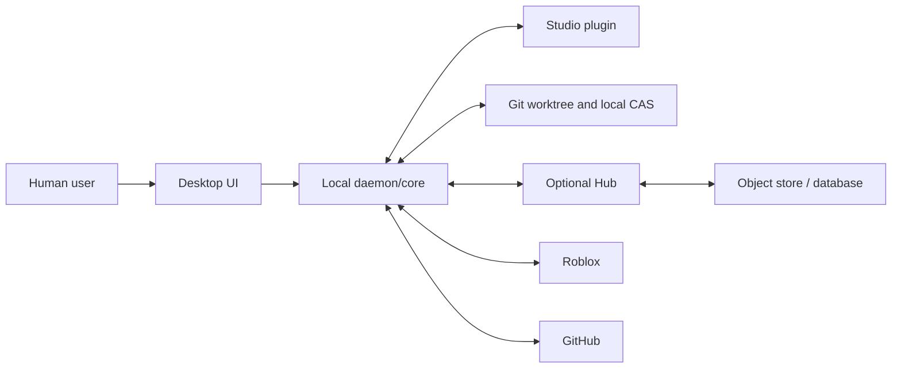

# SPEC-01 — Product Boundaries and Invariants

Status: Draft  
Version: 0.1.0  
Last updated: 2026-07-09  
Depends on: SPEC-00

## 1. Product objective

NeuMan SHALL provide a trustworthy, open-source workflow for authoring Roblox art in Studio, authoring code in Git, synchronizing both into developer places, producing reviewable builds, publishing places, detecting drift, and recovering from failures without hiding the underlying source systems.

The primary product quality is **explainability**: at any time, a user MUST be able to answer which code, art, dependencies, tools, actor, target, and policy produced a deployed place version.

## 2. Goals

- Official Roblox OAuth for identity and supported management operations.
- GitHub-centered code workflow with normal commits, branches, PRs, and checks.
- No-reopen Studio updates for accepted art and code changes.
- Native-fidelity preservation of supported Roblox art content.
- Explicit, enforceable ownership boundaries.
- Reproducible logical builds and immutable promotion inputs.
- Safe staging, production publication, rollback, and drift adoption.
- Windows and macOS Studio workflows.
- Local-only mode and an optional self-hosted team mode.
- Public protocols, schemas, conformance tests, and permissive open-source licensing.

## 3. Non-goals

NeuMan SHALL NOT:

- replace Roblox Studio's editor or Team Create;
- provide a generic merge algorithm for arbitrary binary Roblox models;
- rely on undocumented Roblox cookie APIs;
- collect a public user's Roblox API key;
- silently execute repository-supplied code on the host or with command-bar permissions;
- promise an atomic transaction across multiple Roblox places;
- make production a writable authoring source;
- operate or require a NeuMan-hosted account, project database, OAuth proxy, control plane, art store, or telemetry service;
- guarantee Linux Studio integration while Roblox Studio is unsupported there;
- provide DCC editing or semantic merge for `.blend`, `.psd`, `.fbx`, or similar formats;
- bypass Roblox permissions, moderation, group roles, consent, or application review.

## 4. Actors

| Actor | Responsibilities | Typical permissions |
|---|---|---|
| Artist | Edits and checkpoints art cells/terrain/service state | Art edit, cell locks |
| Developer | Edits Git code, receives accepted art, tests locally | Repository write, sandbox place edit |
| Reviewer | Reviews art/code/build changes | Read plus approval |
| Release manager | Creates and promotes releases | Staging publish; production request |
| Production approver | Approves protected deployment | Production approval |
| Project administrator | Configures ownership, environments, roles | Project admin |
| Hub operator | Operates self-hosted services and backups | Infrastructure admin, no implicit project content authority |
| OAuth application operator | Registers Roblox/GitHub apps | Credential rotation and compliance |
| Automation principal | Runs approved CI workflows | Narrow environment-specific scopes |
| Support engineer | Reads redacted diagnostics with consent | No content or credentials by default |

A person MAY hold multiple roles. Authorization evaluates the active role and action, not job title.

## 5. External systems

- Roblox OAuth authorization server
- Roblox Open Cloud APIs
- Roblox Studio and its command-line interface
- Roblox Team Create and place version history
- Git executable and credential helpers
- Rojo CLI and Studio plugin behavior
- GitHub Git transport and GitHub App APIs
- Git LFS server
- optional user-operated NeuMan Hub, PostgreSQL, and S3-compatible storage
- optional Lore server/provider
- operating-system keychain, process manager, filesystem, and code-signing facilities

## 6. Deployment modes

### 6.1 Local mode

Components: desktop, daemon, CLI, Studio plugin, Git, Rojo, local CAS. GitHub and Roblox services remain external. Features unavailable without Hub are remote presence, server-enforced locks, immediate team event relay, centralized approvals, and shared audit retention.

### 6.2 Self-hosted team mode

Adds Hub, PostgreSQL, S3-compatible storage, GitHub App webhook receiver, project roles, locks, presence, shared revisions, and release coordination.

### 6.3 No vendor-hosted mode

The official NeuMan project SHALL NOT operate a runtime control plane or central project database. The official desktop has no NeuMan account and does not proxy Roblox OAuth. Project metadata and content remain local unless the user configures infrastructure they or their organization operate. Third parties MAY run a compatible Hub under their own identity and terms, but such a service is not part of the official product trust boundary.

GitHub is the official source and binary-distribution channel. Fetching source, release metadata, updates, checksums, or attestations from GitHub MUST NOT make GitHub or NeuMan a correctness authority for a user's local project, and loss of GitHub availability MUST NOT prevent opening cached local work.

## 7. Trust boundaries

Boundaries:

- The UI is less trusted than the Rust command boundary; all mutations are revalidated by core.
- The Studio plugin is a paired local client, not a credential vault.
- Git repository contents are untrusted input until policy validation.
- Hub content is untrusted until hash, signature, authorization, and project binding checks pass.
- Roblox and GitHub responses are authenticated external input and still require schema validation.
- Object-store possession does not grant project authorization.

## 8. Product invariants

### Authority and provenance

- **INV-001** Every managed DataModel path MUST have exactly one declared owner at a given revision.
- **INV-002** Git-authored code MUST originate from a committed Git object before it becomes a release input.
- **INV-003** Studio-authored art MUST originate from a registered authoring channel and become an immutable accepted art revision before release.
- **INV-004** Production MUST be modeled as a deployment output. Production changes MUST enter authoring through an explicit drift-adoption workflow.
- **INV-005** Every build MUST identify its code commit, art revision, dependency set, base template, policy revision, and toolchain.
- **INV-006** Every publication MUST identify the exact logical build and release bundle used.
- **INV-007** User-facing history MUST distinguish observed, proposed, accepted, built, staged, and published state.

### Mutation safety

- **INV-008** Incoming art MUST NOT overwrite a locally dirty cell without an explicit conflict resolution.
- **INV-009** A code synchronization MUST NOT mutate Git-owned Studio state without a corresponding filesystem state.
- **INV-010** An art apply MUST be performed inside a Studio undo/redo recording or fail before mutation.
- **INV-011** An unresolved external instance reference MUST block acceptance and release.
- **INV-012** A release operation MUST verify target universe and place identity immediately before mutation.
- **INV-013** Production publication MUST require explicit user or policy approval; background synchronization cannot imply release approval.
- **INV-014** NeuMan MUST NOT claim a successful mutation until the authoritative external system confirms it or the result is independently observed.

### Binary content and merge

- **INV-015** Native Roblox bytes are the reconstruction authority for an art cell; semantic indexes are review aids.
- **INV-016** Concurrent changes to disjoint cells MAY merge automatically.
- **INV-017** Concurrent changes to the same cell MUST produce a conflict unless one side is unchanged from the common base.
- **INV-018** Chunk-level storage deduplication MUST NOT be described or implemented as semantic merge.
- **INV-019** Terrain regions and singleton service state MUST use ownership and lock semantics appropriate to their non-model representation.

### Credentials and authorization

- **INV-020** The public application MUST NOT request, transmit, or store another user's Roblox API key.
- **INV-021** Roblox OAuth and GitHub tokens MUST NOT enter the Studio plugin.
- **INV-022** Durable credentials MUST be stored in the operating-system credential vault or a deployment secret manager.
- **INV-023** Authorization MUST be checked at the mutation point, not only when rendering UI.
- **INV-024** A Hub role MUST NOT be inferred solely from possession of a blob URL, Git commit, Roblox ID, or client-supplied claim.

### Release and recovery

- **INV-025** Staging and production promotion MUST use the same immutable release bundle and logical build ID.
- **INV-026** NeuMan MUST NOT rebuild mutable inputs between staging verification and production promotion.
- **INV-027** Every production release MUST have a known rollback target or be explicitly marked non-rollbackable before approval.
- **INV-028** Multi-place release status MUST expose partial success; it MUST NOT collapse partial publication into success or failure without detail.
- **INV-029** Destructive recovery actions MUST be explicit, auditable, and idempotent where possible.

### Compatibility and openness

- **INV-030** Persisted schemas and protocols MUST be versioned.
- **INV-031** A compatibility mismatch MUST be detected before mutation.
- **INV-032** A self-hosted deployment MUST be able to export all project metadata and content without a proprietary service.
- **INV-033** Correctness-critical algorithms and schemas MUST have public conformance tests.
- **INV-034** Platform limitations MUST be shown as limitations, not hidden through unsupported automation.

### Privacy and observability

- **INV-035** Telemetry MUST be opt-in unless it is strictly local operational logging.
- **INV-036** Support bundles MUST be previewable and redacted before upload.
- **INV-037** Tokens, secrets, cookies, authorization codes, and raw credential headers MUST never be logged.
- **INV-038** Audit events MUST record actor, action, project, target, input identity, result, and time without storing unnecessary personal data.

### Local-first distribution and identity

- **INV-039** The official product MUST NOT require or operate a NeuMan-hosted account, runtime API, OAuth callback proxy, project database, artifact database, or telemetry collector.
- **INV-040** Official desktop Roblox authentication MUST be a public OAuth client using system-browser authorization code with S256 PKCE and MUST contain no client secret.
- **INV-041** Official builds MAY embed the registered public client ID; self-builders MAY supply their own. An official build MUST NOT allow runtime replacement of its compiled OAuth identity.
- **INV-042** If an OS credential backend is unavailable, locked, or denied, credential persistence MUST fail closed without a plaintext, SQLite, renderer, environment-variable, or project-file fallback.
- **INV-043** Official binaries MUST originate from the protected GitHub release workflow and carry native platform signatures where applicable, independent updater signatures, SHA-256 checksums, and repository-bound build-provenance attestations.
- **INV-044** Team coordination infrastructure MUST be optional and user-operated. The desktop MUST remain useful in local mode and MUST label third-party compatible hosting as external, not official NeuMan infrastructure.

## 9. Supported platform baseline

Alpha baseline:

- Windows 11 x64 with currently supported Roblox Studio.
- macOS 14+ on Apple Silicon with currently supported Roblox Studio.
- Git 2.45+ or a compatibility-tested later version.
- project-pinned Rojo 7.7.x during the initial spike; final minimum set by compatibility evidence.
- Hub deployment on Linux x86-64/ARM64 containers.

The CLI MAY support additional systems. Unsupported systems MUST fail with an actionable compatibility result, not undefined behavior.

## 10. Roblox environment topology

Serious projects SHOULD use:

1. authoring universe for Team Create art channels and developer sandboxes;
2. staging universe mirroring production place topology;
3. production universe writable only through release workflows.

Environment IDs are explicit configuration. NeuMan MUST NOT infer staging or production from names alone.

## 11. Data classification

| Class | Examples | Default handling |
|---|---|---|
| Public | Open-source code, public schemas, public docs | May be published |
| Project | Private source, art cells, manifests, previews | Authorized project members only |
| Sensitive | User IDs, private repo paths, audit actors | Minimize, encrypt in transit/at rest |
| Secret | OAuth tokens, signing keys, DB credentials | Keychain/secret manager only; never logs |
| High-impact | Production approval, publish capability, rollback capability | Strong auth, audit, optional two-person rule |

## 12. Availability expectations

- Local editing and cached checkout SHOULD continue if Hub is unavailable.
- New shared locks, accepted revisions, and coordinated releases MUST stop when authoritative coordination is unavailable.
- Studio plugin disconnection MUST never destroy local work.
- GitHub or Roblox outages MUST yield queued/read-only states with retry guidance.

Detailed SLOs are in SPEC-19.

## 13. Acceptance criteria

SPEC-01 is accepted when:

1. every component spec references these invariants;
2. each invariant maps to at least one verification item in SPEC-22;
3. no documented workflow creates overlapping ownership;
4. no supported public flow requires a user Roblox API key;
5. a reviewer can trace code, art, build, release, and deployment identities end-to-end;
6. partial failure and offline behavior are explicitly represented;
7. no documented official flow depends on a NeuMan-operated runtime or central database;
8. public-client PKCE, OS-vault fail-closed behavior, and the GitHub signing/provenance chain map to release-blocking evidence in SPEC-22.
